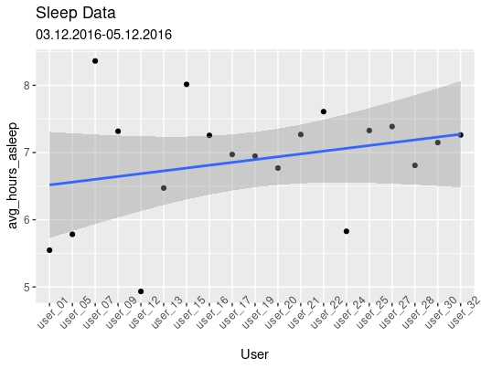

# Google Data Analytics Professional Certificate Capstone Project #1
## BellaBeat
## Introduction
You are a junior data analyst working on the marketing analyst team at Bellabeat, a high-tech manufacturer of health-focused
products for women. Bellabeat is a successful small company, but they have the potential to become a larger player in the
global smart device market. Urška Sršen, cofounder and Chief Creative Officer of Bellabeat, believes that analyzing smart
device fitness data could help unlock new growth opportunities for the company. You have been asked to focus on one of
Bellabeat’s products and analyze smart device data to gain insight into how consumers are using their smart devices. The
insights you discover will then help guide marketing strategy for the company. You will present your analysis to the Bellabeat
executive team along with your high-level recommendations for Bellabeat’s marketing strategy.

## Characters and products
* Characters
  * Urška Sršen: Bellabeat’s cofounder and Chief Creative Officer
  * Sando Mur: Mathematician and Bellabeat’s cofounder; key member of the Bellabeat executive team
  * Bellabeat marketing analytics team: A team of data analysts responsible for collecting, analyzing, and
reporting data that helps guide Bellabeat’s marketing strategy. You joined this team six months ago and have
been busy learning about Bellabeat’’s mission and business goals — as well as how you, as a junior data analyst,
can help Bellabeat achieve them.
* Products
  * Bellabeat app: The Bellabeat app provides users with health data related to their activity, sleep, stress,
menstrual cycle, and mindfulness habits. This data can help users better understand their current habits and
make healthy decisions. The Bellabeat app connects to their line of smart wellness products.
  * Leaf: Bellabeat’s classic wellness tracker can be worn as a bracelet, necklace, or clip. The Leaf tracker connects
to the Bellabeat app to track activity, sleep, and stress.
  * Time: This wellness watch combines the timeless look of a classic timepiece with smart technology to track user
activity, sleep, and stress. The Time watch connects to the Bellabeat app to provide you with insights into your
daily wellness.
  * Spring: This is a water bottle that tracks daily water intake using smart technology to ensure that you are
appropriately hydrated throughout the day. The Spring bottle connects to the Bellabeat app to track your
hydration levels.
  * Bellabeat membership: Bellabeat also offers a subscription-based membership program for users.
Membership gives users 24/7 access to fully personalized guidance on nutrition, activity, sleep, health and
beauty, and mindfulness based on their lifestyle and goals.

# Step 1 - Ask
Sršen asks you to analyze smart device usage data in order to gain insight into how consumers use non-Bellabeat smart
devices. She then wants you to select one Bellabeat product to apply these insights to in your presentation. These questions
will guide your analysis:

1. What are some trends in smart device usage? Sleep patterns of users, correlation between intensity and heart rate, and missing weight log information.
2. How could these trends apply to Bellabeat customers? Sleep patterns, correlation, and weight log information of non Bellabeat smart device users will likely resemble that of Bellabeat customers, thus these trends in data will inform the marketing team of how users are using the smart devices. These trends can then be used to influence and market the Bellabeat app.
3. How could these trends help influence Bellabeat marketing strategy? By leveraging the data extracted from these data sets Bellabeat will be able to pinpoint the usage of smart devices and focus on marketing those strengths to future Bellabeat customers. 

**Guiding questions**

* What is the problem you are trying to solve? How can I use the trends in data from non Bellabeat smart devices to influence the marketing strategy of one of Bellabeat’s own products? 
* How can your insights drive business decisions? The insights received from analyzing these data sets can help drive business decisions based on how to market the product, what features of the product to enhance or improve on, and what features to disable or ways to save money within the product line (least used features of the product based on trends in smart device data.) 

#### Business Task
Bellabeat has hired a team of data analysts to analyze smart device usage data in order to gain insight into how consumers are using non-Bellabeat smart devices. The trends I discover in this data will influence marketing strategy for the Bellabeat app. These insights can drive business decisions based on how to market the product, what features of the product to enhance or optimize, and what features to disable or do away with.

# Step 2 - Prepare

* Where is your data stored? Excel
* How is the data organized? Is it in long or wide format? Long
* Are there issues with bias or credibility in this data? Yes, there are issues with bias and credibility because it is survey based so only users who are interested in responding provide the data. Secondly, the amount of data provided is from 30 users only which is not a large enough sample size for unbiased data. Lastly, there are outside factors which could affect data results. For example, time line: the data supplied is for 2 months in spring, however, exercise habits change from season to season. 
* Does your data ROCCC? 
Reliable - Yes data is from Amazon a trustworthy source 
Original - yes data comes from 30 original users from a specific time period 
Comprehensive -  No, incomplete data due to low sample size
Current - Data is relatively old (2016)
Cited - yes, Amazon Mechanical Turk 
* How are you addressing licensing, privacy, security, and accessibility?  No licensing/privacy issues because data comes from an open source, security is fine because no personal information is used and accessibility is easy. 
* How did you verify the data’s integrity? Maintained log of manipulations and kept data in one secure location
* How does it help you answer your question? We can use the data from non Bellabeat smart device users to help bring analytical and data driven trends in user usage in order to influence the success of the marketing strategy of Bellabeat app. 
* Are there any problems with the data? Missing data, outliers, and light format issues. 


#### Description of Data Sources
[FitBit Fitness Tracker Data](https://www.kaggle.com/datasets/arashnic/fitbit) (CC0: Public Domain, dataset made available through Mobius): This Kaggle data set contains personal fitness tracker from thirty fitbit users. Thirty eligible Fitbit users consented to the submission of personal tracker data, including minute-level output for physical activity, heart rate, and sleep monitoring. It includes information about daily activity, steps, and heart rate that can be used to explore users’ habits.

# Step 3 - Process 

* What tools are you choosing and why? Excel and R for data cleaning/visualizations and tableau for a dashboard. 
* Have you ensured your data’s integrity? Throughout my process I will log updates/changes to data sets.
* What steps have you taken to ensure that your data is clean? Check formatting, blank cells, extra white spaces, misspelling, and duplicates.
* How can you verify that your data is clean and ready to analyze? Ensuring that formatting is correct, remove/update missing data, and check for misspellings and flaws. 
* Have you documented your cleaning process so you can review and share those results? Yes

# Documented Cleaning Process
##### Import datasets
First I imported sleepDay_merged, weightLogInfo_merged, heartrate_seconds_merged, and hourlyIntensities data sets.
```{r}
sleep_data <- read.csv("/cloud/project/capstone project/R Projects/sleepDay_merged.csv")
```
```{r}
weightLog_data <- read.csv("/cloud/project/capstone project/R Projects/weightLogInfo_merged.csv")
```
```{r}
heartrate_data <- read.csv("/cloud/project/capstone project/R Projects/heartrate_seconds_merged.csv")
```
```{r}
hourlyIntensities_data <- read.csv("/cloud/project/capstone project/R Projects/hourlyIntensities_merged2.csv")
```
##### View datasets
Next, I viewed the head of these data sets
```{r}
glimpse(sleep_data)
```
```{r}
glimpse(weightLog_data)
```
```{r}
glimpse(heartrate_data)
```
```{r}
glimpse(hourlyIntensities_data)
```

##### Check for structural errors
first issue I see is that categories SleepDay, Date, Time, and ActivityHour variables all have character format instead of datetime, I will change these variables to the correct format. Starting with WeightLog_data.
```{r}
weightLog_data[['Date']] <- as.POSIXct(weightLog_data[['Date']], format="%m/%d/%Y %H:%M")
```
```{r}
sleep_data[["SleepDay"]] <- as.POSIXct(sleep_data[["SleepDay"]],format="%m/%d/%Y %H:%M:%S %p")
```
```{r}
heartrate_data[["Time"]] <- as.POSIXct(heartrate_data[["Time"]],format="%m/%d/%Y %H:%M:%S %p")
```
```{r}
hourlyIntensities_data[["ActivityHour"]] <- as.POSIXct(hourlyIntensities_data[["ActivityHour"]],format="%m/%d/%Y %H:%M:%S %p")
```

Next I notice is that Id variable contains number values to identify users and I would like to add a new category which correlates these number values to character values user_1 through user_33. I performed this operation on sleep_data.

```{r}
sleep_data <- purrr::map2_df(
  .x = c(1503960366, 1624580081, 1644430081, 1844505072, 1927972279, 2022484408, 2026352035, 2320127002, 2347167796, 2873212765, 3372868164, 3977333714, 4020332650, 4057192912, 4319703577, 4388161847, 4445114986, 4558609924, 4702921684, 5553957443, 5577150313, 6117666160, 6290855005, 6775888955, 6962181067, 7007744171, 7086361926, 8053475328, 8253242879, 8378563200, 8583815059, 8792009665, 8877689391),
  .y = c("user_01", "user_02", "user_03", "user_04", "user_05", "user_06", "user_07", "user_08", "user_09", "user_10",
 "user_11", "user_12", "user_13", "user_14", "user_15", "user_16", "user_17", "user_18", "user_19", "user_20",
 "user_21", "user_22", "user_23", "user_24", "user_25", "user_26", "user_27", "user_28", "user_29", "user_30",
 "user_31", "user_32", "user_33"),
 ~ sleep_data %>%
   dplyr::mutate(User = if_else(Id == .x,.y,""))
) %>%
  dplyr::filter(User != "") %>%
  dplyr::relocate(User,.after = Id)
```

##### Check for irregularities
```{r}
summary(sleep_data)
```
First thing I notice in TotalMinutesAsleep is Min value of less than an hour and Max value higher than 13 hours.
```{r}
796/60
10*60
248/60
961/60
248/60
```
To remove these outliers from TotalMinutesAsleep and TotalTimeinBed
```{r}
sleep_data <- sleep_data[-c(which(sleep_data$TotalMinutesAsleep > 552 | sleep_data$TotalMinutesAsleep < 180 | sleep_data$TotalTimeInBed > 660)), ]
```
remove rows where users recorded sleep records more than once a day $TotalSleepRecords > 1 
```{r}
sleep_data <- sleep_data[-c(which(sleep_data$TotalSleepRecords > 1.0)), ]
```
##### Cleaning and Filtering

Step 1: **heartrate_data**
heartrate_data is a very large data set so I filter 'heartrate_data' to contain data for user_6 only
```{r}
heartrate_data <- filter(heartrate_data, Id == "2022484408")
```
and then filter for date
```{r}
heartrate_data <- heartrate_data %>% filter(grepl('4/12/2016', Time))
```
and then re label Id to user_6
```{r}
heartrate_data[heartrate_data == "2022484408"] <- "user_6"
```

Step 2: **Sleep Data** 
convert TotalMinutesAsleep to TotalHoursAsleep, apply TotalHoursAsleep to sleep_data
```{r}
TotalHoursAsleep <- sleep_data$TotalMinutesAsleep/60
sleep_data$TotalHoursAsleep <- TotalHoursAsleep
```
mean hours asleep for each user, rename TotalHoursAsleep to avghoursasleep
```{r}
sleep_datatwo <- aggregate(TotalHoursAsleep ~ User, sleep_data, mean)
sleep_datatwo <- sleep_datatwo %>% 
  rename(
    avg_hours_asleep = TotalHoursAsleep)
```
```{r}
view(sleep_datatwo)
```


Step 3: **hourlyIntensities_data**
filter hourlyIntensities_data for user_6 and 4/12/2016
```{r}
hourlyIntensities_data <- filter(hourlyIntensities_data, Id == "2022484408", grepl('4/12/2016', ActivityHour)) %>%
  mutate(Id = recode(Id, "2022484408" = "user_6"))
```
remove first 10 characters from ActivityHour Variable to create new Value (variable)
```{r}
hourlyIntensities_data$ActivityHour <- str_sub(hourlyIntensities_data$ActivityHour, 11, 21)
```
remove :00 from hourlyIntensities_data$ActivityHour
```{r}
hourlyIntensities_data$ActivityHour <- gsub(':00 '," ", hourlyIntensities_data$ActivityHour)
```
create plot showing intensities through out day
```{r, fig.show='hide'}
ggplot(data=hourlyIntensities_data) +
  geom_point(mapping = aes(x = ActivityHour, y = AverageIntensity)) +
  theme(axis.text.x = element_text(angle = 45))
```
create x axis limits then use scale_x_discrete
```{r}
axisorder <- c("7:00 AM", "8:00 AM", "9:00 AM", "10:00 AM", "11:00 AM", "12:00 AM","1:00 PM","2:00 PM",
               "3:00 PM","4:00 PM","5:00 PM","6:00 PM","7:00 PM","8:00 PM")
```

Step 4: **Weight Log Data**

find number of times each user used Weight Log
```{r}
table(weightLogInfo_merged$Id)
```
create data frame with info 
```{r}
id <- as.factor(c('user_01','user_05','user_10','user_15','user_18','user_21','user_25','user_33'))
times_used <- as.numeric(c('2','1','2','2','5','1','30','24'))
repeated_users <- data.frame(id, times_used)
```

# Step 4 - Analyze

* How should you organize your data to perform analysis on it? Load data sets into R which will be used for analyzation. Update time/date formats for R processing, and organize by user instead of number string. 
* Has your data been properly formatted? yes
* What surprises did you discover in the data? Plenty of missing data/outliers and weight log data was very lightly used. 
* What trends or relationships did you find in the data? Sleep users are typically getting in the range of 6 – 8 hours of sleep a night (with exception of a few below and above.) Heart rate and Average Intensity are strongly correlated.
* How will these insights help answer your business questions? Promoting sleep times within the Bellabeat app will be a way to create value as this is a way that many users are using their smart devices. Average intensity data and how it correlates to heart rate can be useful for users to understand when attempting lose weight, and the missing data entry for weight log information is something to be worked on to make it easier for users to track their weight and BMI.  


#### Summary of Analysis
After reviewing these data sets I have discovered three major trends. First is from the sleepday_merged data set. Here, I analyzed the average hours of sleep each user is getting per night, from March 12 through April 12. After dropping outliers and analyzing the data it is apparent that users are getting between 6 to 8 hours of sleep. My second analyzation was of the heartrate_seconds_merged and hourlyntensity_merged data sets. After analyzing data for user 6 on 4/12/16, it is noticeable the effect that average intensity has on heart rate. These two variables are strongly correlated with a correlation coefficient of **0.878**. My last analysis was of weight log information. Trends in this data set show that many users are not logging their weight information. 

# Step 5 - Share

* Were you able to answer the business questions? Yes, After analyzing trends in sleep, heart rate and intensity, and weight log our business question, "how can we use trends in data from non bellabeat smart device users to inform the marketing strategy of one Bellabeat product: Bellabeat app?" has been answered. We can use the information on sleep data to market our apps potential of monitoring sleep and creating alarms to notify you of when prime times of sleep/awake are. In addition to this the Bellabeat team must add value to weight log in order to create additional features to use within the app that are currently being let down. Thirdly after monitoring intensity and heart rate it is clear to see correlations and this is a steady of example of two data inputs that could be combined for graphs within the app. 
* What story does your data tell? The data gives us insight into how smart device users are using the product, their own personal sleep/exercise habits, and how we can implement these trends into our own product to create success for Bellabeat. 
* How do your findings relate to your original question? Lack of weight information shows a weak point in measuring data and a way to better our product, sleep data shows a way to create value within the Bellabeat app, intensity and heart rate data is a good way to help target a niche of customers who will have value added to their lives by purchasing Bellabeat product. 
* Who is your audience? What is the best way to communicate with them? Audience is a marketing team within Bellabeat, best way to communicate with them is through presentation. 
* Can data visualization help you share your findings? Yes, data visualizations are key for expressing findings from the analysis. 
* Is your presentation accessible to your audience? Yes presentation is accessible to audience

#### Visualizations and Key Findings 

#### Sleep Patterns 

This visualization represents sleep patterns of users. I have decided to drop data from user 4 and user 18 due to unrealistic sleep times. 22 of 33 users were included in this data set due to lack of input data.

My first analysis will be of sleepDay_merged data. I want to analyze normal amount of sleep per user from April to May of 2016.



### Summary Statistics: Sleep Patterns
I have decided to create summary statistics for users 5, 13, and 17 in order to analyze specifics of nightly sleep schedules. The users were chosen at random to avoid bias.

```{r, echo=FALSE}
sleepday_merged_User51 <- data.frame(my_data)
```

```{r, echo=FALSE}
sleepday_merged_User5 <- filter(sleepday_merged_User51, Id == 1927972279)
```

```{r, echo=FALSE}
sleepday_merged_User13 <- filter(sleepday_merged_User51, Id == 4020332650)
```

```{r, echo=FALSE}
sleepday_merged_User17 <- filter(sleepday_merged_User51, Id == 4445114986)
```

```{r}
summary(sleepday_merged_User13$TotalHoursAsleep)
```

```{r}
summary(sleepday_merged_User17$TotalHoursAsleep)
```

```{r}
summary(sleepday_merged_User5$TotalHoursAsleep)
```

# Summary of Analysis

After reviewing these data sets I have discovered three major trends. First is from the "sleepday_merged data set." Here, I analyzed the average hours of sleep each user is getting per night, from April 2016 through May 2016. After dropping outliers and analyzing the data it is apparent that users are getting between 6 to 8 hours of sleep. My second analyzation was of "heartrate_seconds_merged data set" and "hourlyintensity_merged data set." After analyzing data for user 6 on 4/12/16, it is noticeable the effect that average intensity has on heart rate. These two variables are strongly correlated with a correlation coefficient of **0.878**. My last analyzation was of weight log information. Trends in this data set show that many users are not logging their weight information. 

# Recommendations

To influence sales and usage of the Bellabeat app the company will need to implement graphs of sleep, heart rate, intensity, and similar data within the app. Secondly, the implementation of routine sleep notifications to alert users of when to go to sleep to obtain 6-8 hours of sleep will be beneficial as this is the average amount of sleep seen for users within these data sets. Lastly, it will be beneficial for the company to find ways in which users can easily log weight data as this is a major point of missing data within our smart device data sets.
