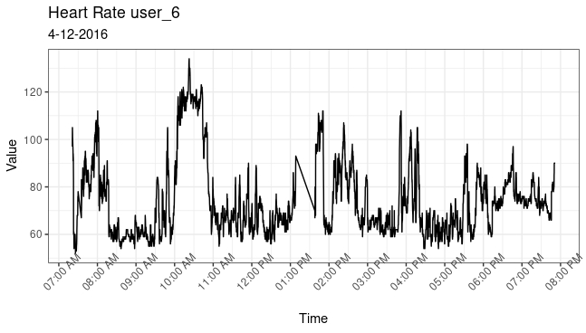

# Google Data Analytics Professional Certificate Capstone Project #1
## BellaBeat
## Introduction
You are a junior data analyst working on the marketing analyst team at Bellabeat, a high-tech manufacturer of health-focused
products for women. Bellabeat is a successful small company, but they have the potential to become a larger player in the
global smart device market. Urška Sršen, cofounder and Chief Creative Officer of Bellabeat, believes that analyzing smart
device fitness data could help unlock new growth opportunities for the company. You have been asked to focus on one of
Bellabeat’s products and analyze smart device data to gain insight into how consumers are using their smart devices. The
insights you discover will then help guide marketing strategy for the company. You will present your analysis to the Bellabeat
executive team along with your high-level recommendations for Bellabeat’s marketing strategy.

## Business Task
Bellabeat has hired a data analyst to analyze smart device usage data in order to gain insight into how consumers use non-Bellabeat smart devices. The trends I discover in this data will influence marketing strategy for the Bellabeat app based on analyzing trends in data from users with smart devices unrelated to Bellabeat products. These insights can drive business decisions based on how to market the product, what features of the product to enhance or optimize, and what features to disable or ways to save money within the product line (least used features of the product based on trends in smart device data.) 

## Description of Data Sources
https://www.kaggle.com/datasets/arashnic/fitbit (FitBit Fitness Tracker Data) (CC0: Public Domain, dataset made available through Mobius): This Kaggle data set
contains personal fitness tracker from thirty fitbit users. Thirty eligible Fitbit users consented to the submission of
personal tracker data, including minute-level output for physical activity, heart rate, and sleep monitoring. It includes
information about daily activity, steps, and heart rate that can be used to explore users’ habits.

## Documented Cleaning Process

(Majority of cleaning done in Microsoft Excel, prior to reading data sets into RStudio. Code examples will be included for any cleaning completed through Rstudio.)

- Changed format of Id from numeric string to 'user_1:33'

- Removed rows containing missing values for TotalSteps and TotalDistance in dailyActivity_merged data set (appears as though user left running but did not use.)

- Dropped rows with missing values in hourlyIntensities_merged, hourlySteps_merged, minuteCaloriesNarrow_merged, and minuteStepsNarrow_merged.

- Removed rows in sleepDay_merged for times less than 2 hours in TotalTimeinBed, I do not consider this to be normal sleeping hours and thus may skew trends in our analysis for a normal night’s sleep.

- dailyActivity_merged: removed outliers for user_2 on 5/1/2016 and user_33 on 4/30/2016 because of VeryActiveDistance greater than 20miles. After comparing VeryActiveDistance to VeryActiveMinutes, it does not make sense unless running at a very fast pace.
       - This datum could be due to other factors such as biking, roller blading, or driving          a vehicle.

- Removed sedentaryactivedistance from dailyintensities_merged data set due to redundancy.

## Summary of Analysis
After reviewing these data sets I have discovered three major trends. First is from the "sleepday_merged data set." Here, I analyzed the average hours of sleep each user is getting per night, from March 12 through April 12. After dropping outliers and analyzing the data it is apparent that users are getting between 6 to 8 hours of sleep. My second analyzation was of the "heartrate_seconds_merged" and "hourlyntensity_merged" data sets. After analyzing data for user 6 on 4/12/16, it is noticeable the effect that average intensity has on heart rate. These two variables are strongly correlated with a correlation coefficient of **0.878**. My last analysis was of weight log information. Trends in this data set show that many users are not logging their weight information. 

# Visualizations and Key Findings
### Sleep Patterns

This visualization represents sleep patterns of users. I have decided to drop data from user 4 and user 18 due to unrealistic sleep times. 22 of 33 users were included in this data set due to lack of input data.

My first analysis will be of sleepDay_merged data. I want to analyze normal amount of sleep per user from April to May of 2016.


read data
```{r}
my_data <- read.csv("CopyOfsleepDay_mergedcleaned.csv")
```
convert totalminutesasleep to totalhoursasleep, apply TotalHoursAsleep to my_data
```{r}
TotalHoursAsleep <- my_data$TotalMinutesAsleep/60 
my_data$TotalHoursAsleep <- TotalHoursAsleep
```
mean hours asleep for each user, rename TotalHoursAsleep to avghoursasleep
```{r}
my_data2 <- aggregate(TotalHoursAsleep ~ Id, my_data, mean)
my_data2 <- my_data2 %>% 
  rename(
    avg_hours_asleep = TotalHoursAsleep)
```
rename all numeric Id values to user_xx and create factor level
```{r}
user_id <- c("user_1", "user_3", "user_4", "user_5", "user_7", "user_9", "user_12","user_13","user_15","user_16",
             "user_17","user_18","user_19","user_20","user_21","user_22","user_24","user_25","user_27","user_28","user_30", "user_32")

lvls2 <- c("user_1", "user_3", "user_4", "user_5", "user_7", "user_9", "user_12","user_13","user_15","user_16",
                      "user_17","user_18","user_19","user_20","user_21","user_22","user_24","user_25","user_27","user_28","user_30", "user_32")
```
assign user_id variable to my_data2, drop user 4 and user 18
```{r}
my_data2$user_id <- user_id
my_data3 <- my_data2[-c(12, 3),]
```
assign factor levels to user_id
```{r}
my_data3$user_id <- factor(my_data3$user_id, levels = lvls2)
```
plot
```{r, fig.show='hide'}
ggplot(data=my_data3, aes(x=user_id,y=avg_hours_asleep, group=1)) +
  geom_point() +
  geom_smooth(formula = y ~ x, method = "lm") +
  theme(axis.text.x = element_text(angle = 45))
```
### Heart rate/Average Intensity

Next, I visualized the data from user 6 on 2016-04-16 from 7AM to 8PM to show how his heart rate varied along with his average intensity. The graphs look similar indicating a strong relationship. This relationship is reinforced by a correlation coefficient of **0.878** measured between heart rate and average intensity.




### Heart Rate

read heart rate data into Studio
```{r}
heartrate_data <- read.csv("heartrate_seconds_merged.csv")
```
rename character ID for user_6
```{r}
heartrate_data[heartrate_data == "2022484408"] <- "user_6"
```
filter heart rate data to contain data for user_6 only
```{r}
heartrate_data_clean1 <- filter(heartrate_data, Id == "user_6")
```
and then filter for specific date
```{r}
user6_hr_April12 <- heartrate_data_clean1 %>% filter(grepl('4/12/2016', Time))
```
plot
```{r, fig.show='hide'}
user6_hr_April12 %>%
  mutate(user6_hr_April12, Time = as.POSIXct(Time, format = "%m/%d/%Y %I:%M:%OS %p")) %>%
  ggplot(aes(x = Time, y = Value)) +
  geom_line() +
  theme_bw() +
  scale_x_datetime(breaks = "1 hour", date_labels = "%I:%M %p") +
  theme(axis.text.x = element_text(angle = 45)) +
  ggtitle("heart rate user_6",
          subtitle = "4-12-2016")
```

### Average Intensity
read data
```{r}
hourlyIntensities_merged2 <- read.csv("hourlyIntensities_merged.csv")
```
filter hourlyIntensities_merged for user_6 on 4/12/2016
```{r}
hourlyIntensitiesclean2 <- filter(hourlyIntensities_merged2, Id == "2022484408", grepl('4/12/2016', ActivityHour)) %>%
  mutate(Id = recode(Id, "2022484408" = "user_6"))
```
remove first 10 characters from ActivityHour Variable
```{r}
hourlyIntensities_mergedcleannew <- 
  gsub("^.{0,10}", "", gsub(':00 '," ", hourlyIntensitiesclean2$ActivityHour))
```
Added edited ActivityHour Varibale into data frame
```{r}
hourlyIntensitiesclean2$ActivityHourII <- hourlyIntensities_mergedcleannew
```
Drop Values 1:00:00 AM through 6:00:00 AM & 9:00:00PM through 12:00:00 PM
```{r}
hourlyIntensitiesclean_dropped2 <- hourlyIntensitiesclean2 %>% slice(-c(1,2,3,4,5,6,7,22,23,24))
```
create x axis limits for scale_x_discrete
```{r}
axisorder <- c("7:00 AM", "8:00 AM", "9:00 AM", "10:00 AM", "11:00 AM", "12:00 AM","1:00 PM","2:00 PM", "3:00 PM","4:00 PM","5:00 PM","6:00 PM","7:00 PM")
```
plot
```{r, fig.show='hide', warning=FALSE}
ggplot(data=hourlyIntensitiesclean_dropped2) +
  geom_point(mapping = aes(x = ActivityHourII, y = AverageIntensity, group = 1)) +
  geom_line(mapping = aes(x = ActivityHourII, y = AverageIntensity, group = 1)) +
  theme(axis.text.x = element_text(angle = 45)) +
  scale_x_discrete(limits = axisorder) +
    ggtitle("Average Intensity user 6",
          subtitle = "4-12-2016")

```

### Weight Log

My third visualization is indicating a lack of data entry in weight log information. The number of users that logged weight information is very small, with many of them logging less than 5 times for the entire month. I am assuming this has to do with weight scales not being available, lack of knowledge on how to measure BMI, or inconveniences in entering data. 


read data
```{r}
weightLogInfo_merged <- read.csv("weightLogInfo_merged.csv")
```
find number of times each user used WeightLog
```{r}
table(weightLogInfo_merged$Id)
```
create data frame with info 
```{r}
id <- as.factor(c('user_1','user_5','user_10','user_15','user_18','user_21','user_25','user_33'))
times_used <- as.numeric(c('2','1','2','2','5','1','30','24'))
repeated_users <- data.frame(id, times_used)
```
plot
```{r, fig.show='hide'}
ggplot(data = repeated_users, aes(x = id, y = times_used)) +
  geom_bar(stat= 'identity')
```

### Summary Statistics: Sleep Patterns
I have decided to create summary statistics for users 5, 13, and 17 in order to analyze specifics of nightly sleep schedules. The users were chosen at random to avoid bias.

```{r, echo=FALSE}
sleepday_merged_User51 <- data.frame(my_data)
```

```{r, echo=FALSE}
sleepday_merged_User5 <- filter(sleepday_merged_User51, Id == 1927972279)
```

```{r, echo=FALSE}
sleepday_merged_User13 <- filter(sleepday_merged_User51, Id == 4020332650)
```

```{r, echo=FALSE}
sleepday_merged_User17 <- filter(sleepday_merged_User51, Id == 4445114986)
```

```{r}
summary(sleepday_merged_User13$TotalHoursAsleep)
```

```{r}
summary(sleepday_merged_User17$TotalHoursAsleep)
```

```{r}
summary(sleepday_merged_User5$TotalHoursAsleep)
```

# Summary of Analysis

After reviewing these data sets I have discovered three major trends. First is from the "sleepday_merged data set." Here, I analyzed the average hours of sleep each user is getting per night, from April 2016 through May of 2016. After dropping outliers and analyzing the data it is apparent that users are getting between 6 to 8 hours of sleep. My second analyzation was of "heartrate_seconds_merged data set" and "hourlyintensity_merged data set." After analyzing data for user 6 on 4/12/16, it is noticeable the effect that average intensity has on heart rate. These two variables are strongly correlated with a correlation coefficient of **0.878**. My last analysis was of weight log information. Trends in this data set show that many users are not logging their weight information. 

# Recommendations

To influence sales and usage of the Bellabeat app the company will need to implement graphs of sleep, heart rate, intensity, and similar data within the app. Routine sleep notifications to alert users of when to go to sleep to obtain 6-8 hours of sleep will be beneficial as this is the average amount of sleep for users within the data sets. Lastly, It will be beneficial for the company to find ways in which users can easily log weight data as this is a point of concern within our data sets.
